This script demonstrates using LogLead MCP with [Goose](https://github.com/aaif-goose/goose) (open-source agentic framework).

## 1. Goose Hints

Very important before you start! Goose needs hints for log analysis. Otherwise it defaults to global searches and its own Python scripts. All that makes it slow and token hungry. So run what is in below or something similar. 

```bash
cat << 'EOF' > ~/.goosehints
# Global Goose Instructions

- Do not perform broad root searches (e.g., `find /`). Restrict searches to the current directory (`.`) or home directory (`~`).
- Always prioritize installed MCP tools (e.g., LogLead MCP) instead of executing raw Python scripts or inspecting code manually via `python3 -c`.
- Avoid scanning virtual environments, `.cache`, or `site-packages` directories.
EOF
```

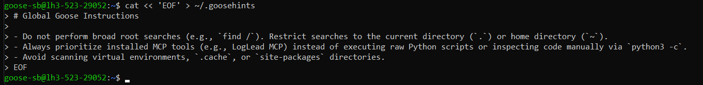

## 2. Find and open data

We ask Goose to find log data we have placed on disk. Once it locates it, we open it with LogLead (MCP).

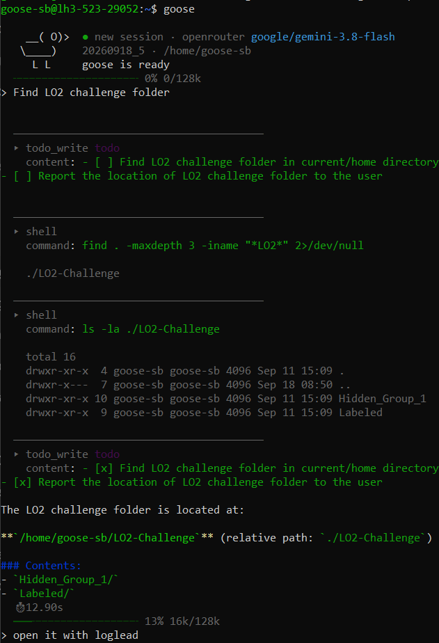

## 3. Data

Once Goose has the file open, it shows what it found.

For this demo we are working with LO2-Challenge, a log anomaly detection dataset given to students at one of the courses in the University of Helsinki. The data is from our paper ([LO2: Microservice API anomaly dataset of logs and metrics](https://dl.acm.org/doi/abs/10.1145/3727582.3728682)), and each run contains execution logs of 7 distinct microservices. LO2 data is huge but for the LO2-challenge each team gets only a small subset of the data with 7 labeled runs and 8 hidden runs that the team needs to label. 

Details of the data are in below as goose sees it. 

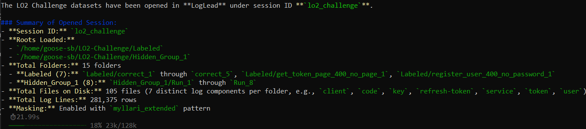

## 4. Anomaly detection strategy development

Now we have the data. We ask our AI agent to develop and evaluate a log anomaly detection strategy using the few labeled runs it has. This takes a while as Goose evaluates different strategies.

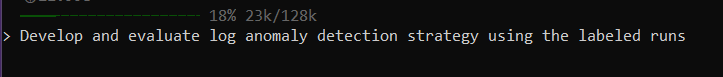

After a few minutes it comes back with a strategy. The strategy starts with log masking. This makes a lot of sense as without proper masks nearly all methods will trip up on differences due to noise in logs. Then the strategy goes top-down from run (a set of logs in a folder), file, and line levels.

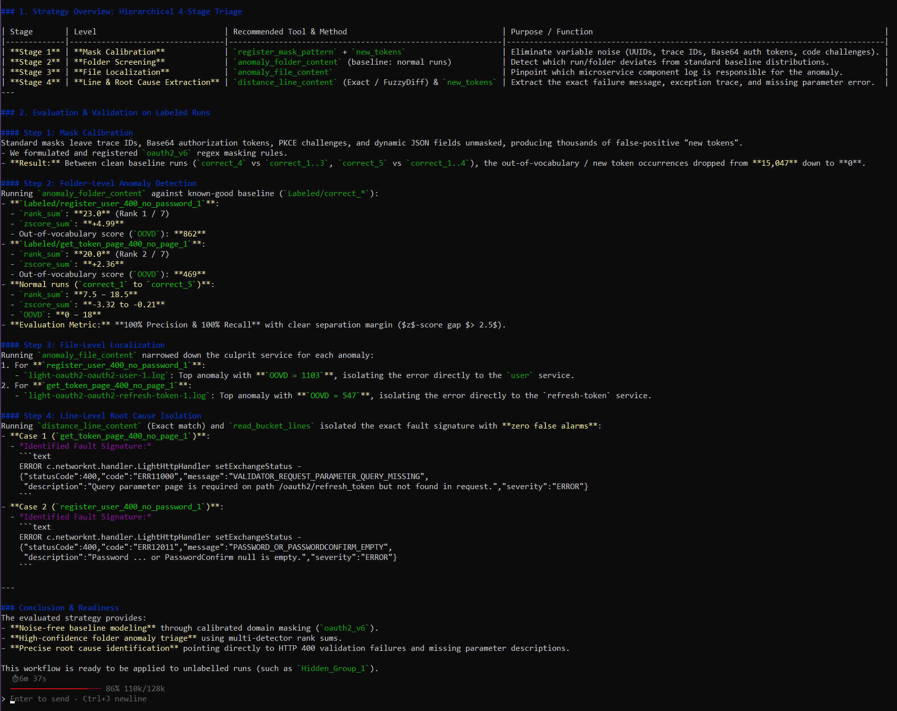

## 5. Using the anomaly detection strategy on mystery data

The strategy seems to make sense. We ask goose to testi it on mystery data and after a while we get the results. 

It presents results on all different levels. High level results below show anomaly scores for mystery files. We can see it judges top 3 rows in the tables as anomalies. In the middle of the table, it points out some unusual behavior in the runs but still judges them as normal. Then the bottom two are declared as normal without any unusual behavior.


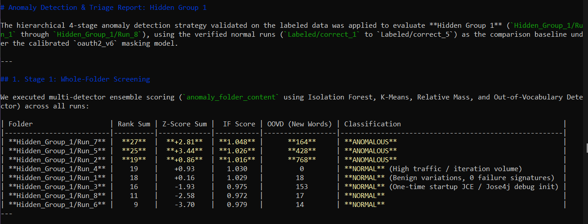

Next it shows a more detailed analysis on the 3 runs it claimed as anomalous. It also matches them to previous anomalies from the labelled data.

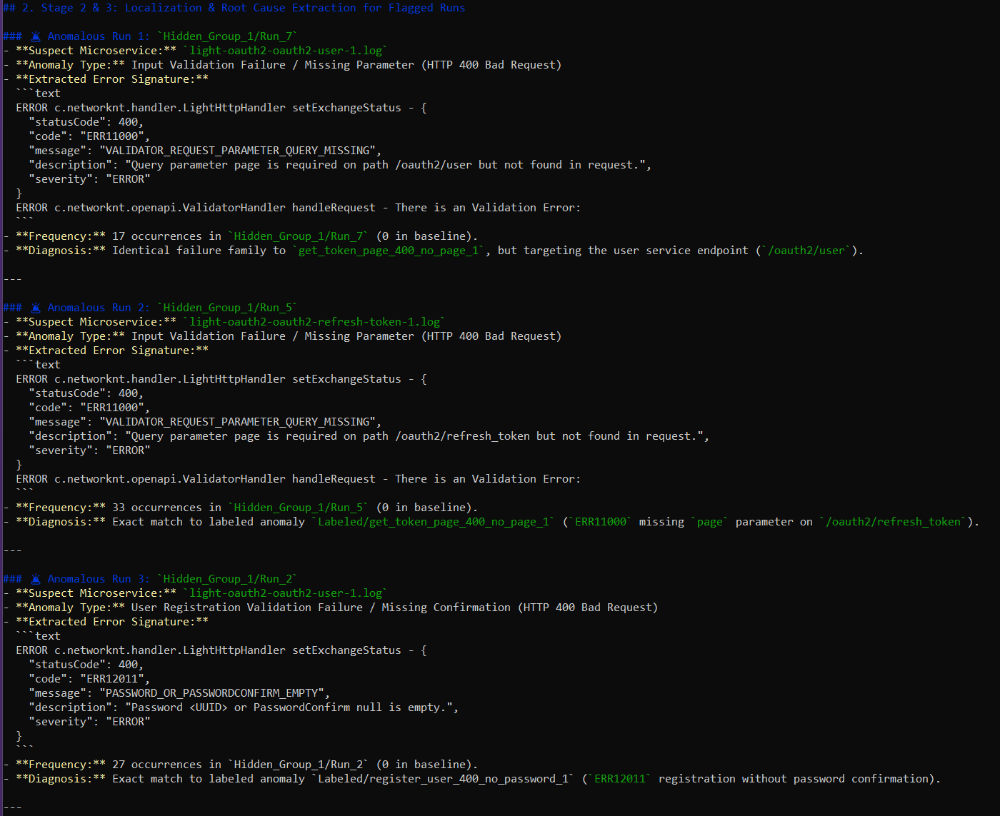

Finally, it presents its conclusion.

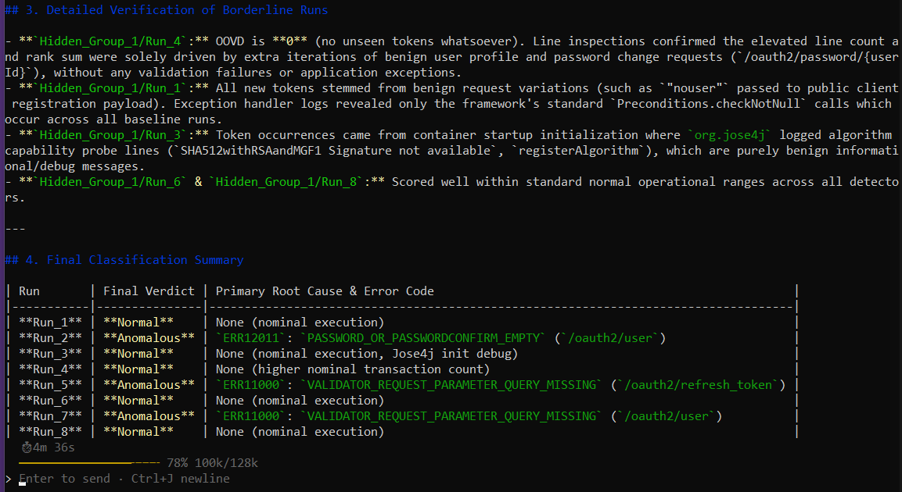

As some cases are unclear, we ask to reevaluate the cases that were normal but still had some unusual behavior in them. 

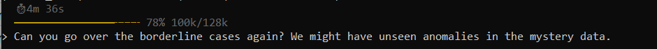

It presents more details on the borderline cases. It appears there is something unusual in them but not enough to declare them as anomalies.

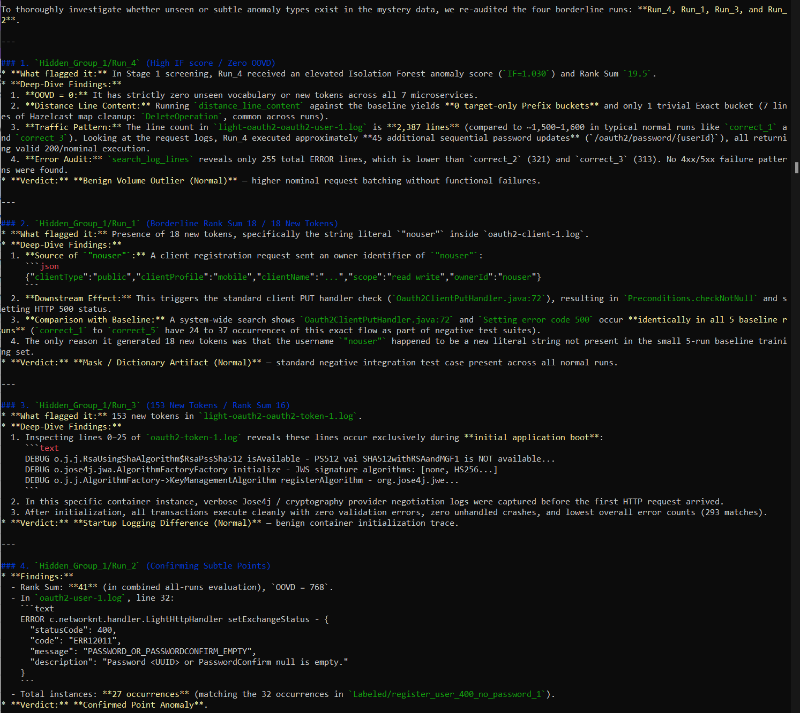

In the final verdict it shows that Run_6 and Run_8 are completely clean. Run_1, Run_3, and Run_4 are declared as normal but with the note that there is some unusual pattern.  Most likely these runs would require human judgement or providing a stricter definition on what an anomaly is.   Run_2, Run_5, and Run_7 are declared as clear anomalies.

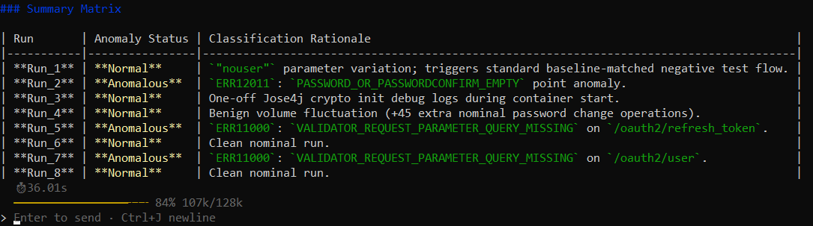
