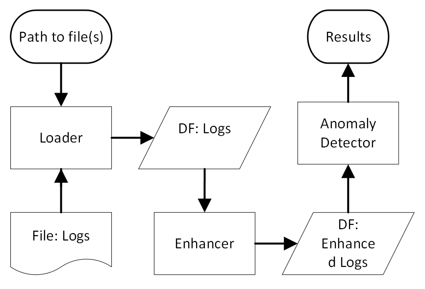

# LogLead
LogLead is designed to efficiently benchmark log anomaly detection algorithms and log representations.


Currently, it features nearly 1,000 unique anomaly detection combinations, encompassing 8 public datasets, 11 log representations (enhancers), and 11 classifiers. These resources enable you to benchmark your own data, log representation, or classifier against a diverse range of scenarios. LogLead is an actively evolving project, and we are continually adding new datasets, representations, and classifiers. If there's something you believe should be included, please submit a request for a dataset, enhancer, or classifier in the [issue tracker](https://github.com/EvoTestOps/LogLead/issues).

A key strength of LogLead is its custom loader system, which efficiently isolates the unique aspects of logs from different systems. This design allows for a reduction in redundant code, as the same enhancement and anomaly detection code can be applied universally once the logs are loaded. 

## Demos
In the following demonstrations, you'll notice a significant aspect of LogLead's design efficiency: code reusability. Both demos, while analyzing different datasets, share a substantial amount of their underlying code. This not only showcases LogLead's versatility in handling various log formats but also its ability to streamline the analysis process through reusable code components.

### Thunderbird Supercomputer Log Demo
- **Script**: [TB_samples.py](https://github.com/EvoTestOps/LogLead/blob/main/demo/TB_samples.py)
- **Description**: This demo presents a Thunderbird supercomputer log, labeled at the line (event) level. A first column marked with “-” indicates normal behavior, while other markings represent anomalies.
- **Log Snapshot**: View the log [here](https://github.com/logpai/loghub/blob/master/Thunderbird/Thunderbird_2k.log_structured.csv).
- **Dataset**: The demo includes a parquet file containing a subset of 263,408 log events, with 21,955 anomalies.
- **Screencast**: For an overview of the demo, watch our [5-minute screencast on YouTube](https://www.youtube.com/watch?v=8stdbtTfJVo).
### Hadoop Distributed File System (HDFS) Log Demo

- **Script**: [HDFS_samples.py](https://github.com/EvoTestOps/LogLead/blob/main/demo/HDFS_samples.py)
- **Description**: This demo showcases logs from the Hadoop Distributed File System (HDFS), labeled at the sequence level (a sequence is a collection of multiple log events).
- **Log Snapshot**: View the log [here](https://github.com/logpai/loghub/blob/master/HDFS/HDFS_2k.log_structured.csv).
- **Anomaly Labels**: Provided in a separate file.
- **Dataset**: The demo includes a parquet file containing a subset of 222,579 log events, forming 11,501 sequences with 350 anomalies.

## Example of Anomaly Detection results
Below you can see anomaly detection results (F1-Binary) trained on 0.5% subset of HDFS data. 
We use 5 different log message enhancement strategies: [Words](https://en.wikipedia.org/wiki/Bag-of-words_model), [Drain](https://github.com/logpai/Drain3), [LenMa](https://github.com/keiichishima/templateminer), [Spell](https://github.com/logpai/logparser/tree/main/logparser/Spell), and [BERT](https://github.com/google-research/bert) 

The enhancement strategies are tested with 5 different machine learning algorithms: DT (Decision Tree), SVM (Support Vector Machine), LR (Logistic Regression), RF (Random Forest), and XGB (eXtreme Gradient Boosting).

|         | Words  | Drain  | Lenma  | Spell  | Bert   | Average |
|---------|--------|--------|--------|--------|--------|---------|
| DT      | 0.9719 | 0.9816 | 0.9803 | 0.9828 | 0.9301 | 0.9693  |
| SVM     | 0.9568 | 0.9591 | 0.9605 | 0.9559 | 0.8569 | 0.9378  |
| LR      | 0.9476 | 0.8879 | 0.8900 | 0.9233 | 0.5841 | 0.8466  |
| RF      | 0.9717 | 0.9749 | 0.9668 | 0.9809 | 0.9382 | 0.9665  |
| XGB     | 0.9721 | 0.9482 | 0.9492 | 0.9535 | 0.9408 | 0.9528  |
|---------|--------|--------|--------|--------|--------|---------|
| Average | 0.9640 | 0.9503 | 0.9494 | 0.9593 | 0.8500 |         |

## Functional overview
LogLead is composed of distinct modules: the Loader, Enhancer, and Anomaly Detector. We use [Polars](https://www.pola.rs/) dataframes as its notably faster than Pandas.



**Loader:** This module reads in the log files and deals with the specifics features of each log file. It produces a dataframe with certain semi-mandatory fields. These fields enable actions in the subsequent stages. LogLead has loaders to the following public datasets from 8 different systems: 
* 4: [HDFS_v1](https://github.com/logpai/loghub/tree/master/HDFS#hdfs_v1), [Hadoop](https://github.com/logpai/loghub/tree/master/Hadoop), [BGL](https://github.com/logpai/loghub/tree/master/BGL), [Thunderbird](https://github.com/logpai/loghub/tree/master/Thunderbird) thanks to amazing [LogHub team](https://github.com/logpai/loghub). For full data see [Zenodo](https://zenodo.org/records/3227177).
* 2: [Sprit and Liberty](https://www.usenix.org/cfdr-data#hpc4) can be found from Usenix site.  
* 2: [Nezha](https://github.com/IntelligentDDS/Nezha) has data from two systems [TrainTicket](https://github.com/FudanSELab/train-ticket) and [Google Cloud Webshop demo](https://github.com/GoogleCloudPlatform/microservices-demo). It is the first dataset of microservice-based systems. Like other traditional log datasets it has Log data but additionally there are Traces and Metrics.

**Enhancer:** This module extracts additional data from logs. The enhancement takes place directly within the dataframes, where new columns are added as a result of the enhancement process. For example, log parsing, the creation of tokens from log messages, and measuring log sequence lengths are all considered forms of log enhancement. Enhancement can happen at the event level or be aggregated to the sequence level. Some of the enhancers available: Event Length (chracters, words, lines), Sequence Length, Sequence [Duration](https://pola-rs.github.io/polars/py-polars/html/reference/api/polars.Duration.html), following "NLP" enhancers: [Regex](https://crates.io/crates/regex), [Words](https://en.wikipedia.org/wiki/Bag-of-words_model), [Character n-grams](https://en.wikipedia.org/wiki/N-gram). Log parsers: [Drain](https://github.com/logpai/Drain3), [LenMa](https://github.com/keiichishima/templateminer), [Spell](https://github.com/bave/pyspell), [IPLoM](https://github.com/EvoTestOps/LogLead/tree/main/parsers/iplom), [AEL](https://github.com/EvoTestOps/LogLead/tree/main/parsers/AEL), [Brain](https://github.com/EvoTestOps/LogLead/tree/main/parsers/Brain), [Fast-IPLoM](https://github.com/EvoTestOps/LogLead/tree/main/parsers/fast_iplom),  [Tipping](https://pypi.org/project/tipping/), and [BERT](https://github.com/google-research/bert). [NextEventPrediction](https://arxiv.org/abs/2202.09214) including its probablities and perplexity. Next event prediction can be computed on top of any of the parser output. 

**Anomaly Detector:** This module uses the enhanced log data to perform Anomaly Detection. It is mainly using SKlearn at the moment but there are few customer algorithms as well. LogLead has been integrated and tested with following models: 
* Supervised (5): [Decision Tree](https://en.wikipedia.org/wiki/Decision_tree), [Support Vector Machine](https://en.wikipedia.org/wiki/Support_vector_machine), [Logistic Regression](https://en.wikipedia.org/wiki/Logistic_regression), [Random Forest](https://en.wikipedia.org/wiki/Random_forest), [eXtreme Gradient Boosting](https://en.wikipedia.org/wiki/XGBoost)
* Unsupervised (4): [One-class SVM](https://en.wikipedia.org/wiki/Support_vector_machine#One-class_SVM), [Local Outlier Factor](https://en.wikipedia.org/wiki/Local_outlier_factor), [Isolation Forest](https://en.wikipedia.org/wiki/Isolation_forest), [K-Means](https://en.wikipedia.org/wiki/K-means_clustering)
* Custom Unsupervised (2): [Out-of-Vocabulary Detector](https://github.com/EvoTestOps/LogLead/blob/main/loglead/OOV_detector.py) counts amount words or character n-grams that are novel in test set. [Rarity Model](https://github.com/EvoTestOps/LogLead/blob/main/loglead/RarityModel.py), scores seen words or character n-grams based on their rarity in training set. See our public [preprint](https://arxiv.org/abs/2312.01934) for more details


## Paper 
More detailed description of the work is documented in our [conference paper](https://arxiv.org/abs/2311.11809). If you use this software in your research, please cite it as below:

```bibtex
@inproceedings{mantyla2023loglead,
  author = {M\"{a}ntyl\"{a}, Mika and Wang, Yuqing and Nyyss\"{o}l\"{a}, Jesse},
  title = {LogLead - Fast and Integrated Log Loader, Enhancer, and Anomaly Detector},
  booktitle = {Proceedings of the IEEE International Conference on Software Analysis, Evolution and Reengineering (SANER)},
  year = {2024},
  publisher = {IEEE},
  address = {Rovaniemi, Finland},
  pages = {1-5},
  url  = {https://arxiv.org/abs/2311.11809}
}
