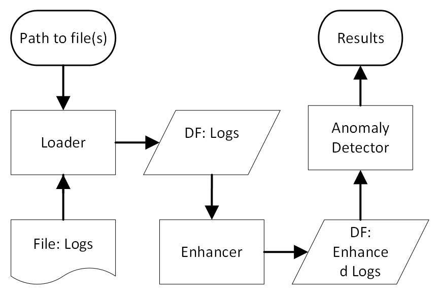

# LogLead
LogLead is designed to efficiently benchmark log anomaly detection algorithms and log representations. LogLead is also usedas a backend for projects such as [LogDelta](https://github.com/EvoTestOps/LogDelta) and [VisualLogAnalyzer](https://github.com/EvoTestOps/VisualLogAnalyzer), which offer a more user-friendly approach to log analysis and log anomaly detection.


Currently, it features nearly 1,000 unique anomaly detection combinations, encompassing 8 public datasets, 11 log representations (enhancers), and 11 classifiers. These resources enable you to benchmark your own data, log representation, or classifier against a diverse range of scenarios. If there's something you believe should be included, please submit a request for a dataset, enhancer, or classifier in the [issue tracker](https://github.com/EvoTestOps/LogLead/issues).

A key strength of LogLead is its custom loader system, which efficiently isolates the unique aspects of logs from different systems. This design allows for a reduction in redundant code, as the same enhancement and anomaly detection code can be applied universally once the logs are loaded. 

**Don't know which loader you need?** [`AutoLoader`](https://github.com/EvoTestOps/LogLead/blob/main/loglead/loaders/auto.py) samples a file, works out its format, and builds the loader that reads it — JSON, web access log, syslog, logfmt, generic timestamped text, or plain text as the fallback. It also recognizes the public datasets that have their own loader (HDFS, Hadoop, ADFA, AWSCTD, Nezha, BGL, Thunderbird) from the label file sitting *beside* the log, so an auto-loaded dataset keeps its anomaly labels and its sequence-level frame:

```python
AutoLoader(filename="mystery.log").execute()                     # one file
AutoLoader(filename="logs", filename_pattern="*.log").execute()  # a tree, detected per file
loader.detections()                                              # what it chose, and how sure
```

Detection is per file, because a folder holding several formats is the normal case rather than the exception — those get read by different loaders and stacked into one frame. Nothing is ever refused: an unrecognized file is read as plain text and said so. See [demo/AutoLoader_samples.py](https://github.com/EvoTestOps/LogLead/blob/main/demo/AutoLoader_samples.py), whose first two sections need no download.

**JSON logs** are supported by a single configurable [`JsonLoader`](https://github.com/EvoTestOps/LogLead/blob/main/loglead/loaders/json.py) rather than a class per dataset, because reading JSON is one Polars call — what actually differs between JSON logs is only the *mapping*: which key is the timestamp, which is the message, which correlates records. That mapping is configuration, so a format spec is nothing more than a serialized call:

```python
JsonLoader(filename="access.json", timestamp_field="time", message_field="request").execute()
JsonLoader(filename="access.json", format="nginx_json").execute()       # shipped spec
JsonLoader(filename="access.json", format="./my_format.yml").execute()  # your own, no fork needed
```

It handles NDJSON, `[...]` arrays and wrapped `{"Records": [...]}` containers, keys that differ from record to record, nested objects addressed JSON-pointer style (`log/logger`), epoch or string timestamps, and whole directory trees. Numeric fields stay numeric, so they are ready for `numeric_cols` without a cast. Shipped specs live in [`loglead/loaders/json_formats/`](https://github.com/EvoTestOps/LogLead/tree/main/loglead/loaders/json_formats); `JsonLoader.available_formats()` lists them.

**Prediction from the log's own fields.** Anomaly detection is usually run over the message text, but most logs also arrive with structured fields — Thunderbird has `component`, `userid`, `location`; BGL has `type`, `level`; a JSON log has its keys — and those predict anomalies on their own. Pass them as `categorical_cols` and `AnomalyDetector` one-hot encodes them into the same matrix the text representations use; on Thunderbird that alone reaches F1 0.75 with no message text at all. For sequence-labeled data, [`SequenceEnhancer.category_counts()`](https://github.com/EvoTestOps/LogLead/blob/main/loglead/enhancers/sequence.py) counts each value per sequence instead ("how many WARN lines does this block have"), which yields numbers for `numeric_cols`. Both are demonstrated in the two demos below.

Choosing which columns to use is its own trap, so [`loglead.select_predictors()`](https://github.com/EvoTestOps/LogLead/blob/main/loglead/column_analyzer.py) profiles a dataframe and picks them, rejecting the label and anything derived from it, identifiers, constants and near-constants. It matters: Thunderbird's `label` column *is* the target (`anomaly == label != "-"`), and BGL's `time` has one distinct value per row — both look like ideal predictors if you only count nulls.

## Installing LogLead

Install with [`uv`](https://docs.astral.sh/uv/):
```
uv add loglead
```
Or with `pip`:
```
python -m pip install loglead
```

Then clone the project, move to demo folder and run some demos
```
git clone https://github.com/EvoTestOps/LogLead.git
cd LogLead
uv run demo/HDFS_samples.py
uv run demo/TB_samples.py
```
Or with `pip` (after installing LogLead into your environment):
```
cd LogLead/demo
python HDFS_samples.py
python TB_samples.py
```
`uv run` syncs the environment from `pyproject.toml`/`uv.lock` on first use, so there's no separate install step before running anything.

To start working with your own data, it is easiest to begin with the [RawLoader](https://github.com/EvoTestOps/LogLead/blob/main/loglead/loaders/raw.py). To try out RawLoader, run the [RawLoaderDemo](https://github.com/EvoTestOps/LogLead/blob/main/demo/RawLoader_NoLabels.py). For this, you will need the original [BGL](https://zenodo.org/records/8196385/files/BGL.zip?download=1) and [HDFS](https://zenodo.org/records/8196385/files/HDFS_v1.zip?download=1) datasets. You will also need to edit the [RawLoaderDemo script](https://github.com/EvoTestOps/LogLead/blob/main/demo/RawLoader_NoLabels.py) or add a ".env" file to your LogLead root so that the demo knows where the data is located on your machine. See [.env.sample](https://github.com/EvoTestOps/LogLead/blob/main/.env.sample) as an example of how the ".env" file should look. After that run the demo
```
uv run demo/RawLoader_NoLabels.py
```
Or with `pip`:
```
python RawLoader_NoLabels.py
```
Finally, you can try downloading all data. The [downloader](https://github.com/EvoTestOps/LogLead/blob/main/downloader/download_data.py) script downloads the public datasets listed in [downloader/datasets.yml](https://github.com/EvoTestOps/LogLead/blob/main/downloader/datasets.yml):
```
uv run downloader/download_data.py
```
Or with `pip` (after cloning the repo):
```
python downloader/download_data.py
```
If you've cloned the repo and want to run the test suite too, point it at one of the
[tests/datasets_*.yml](https://github.com/EvoTestOps/LogLead/tree/main/tests) configs instead — e.g.
[tests/datasets_mid_labels.yml](https://github.com/EvoTestOps/LogLead/blob/main/tests/datasets_mid_labels.yml),
the one `tests/main.py` uses by default — which also controls what gets loaded and how it's used in testing:
```
uv run downloader/download_data.py --config tests/datasets_mid_labels.yml
```
Or with `pip`:
```
python downloader/download_data.py --config tests/datasets_mid_labels.yml
```
**Disk space:** downloading everything in [downloader/datasets.yml](https://github.com/EvoTestOps/LogLead/blob/main/downloader/datasets.yml) transfers roughly 7 GB and the datasets expand to about 104 GB once unzipped. Make sure you have **at least ~110 GB free** before running the full downloader. The three supercomputer logs — Liberty, Spirit, and Thunderbird — account for most of it, at 30-38 GB each once unzipped.

If you're short on space, edit the `datasets:` list in [downloader/datasets.yml](https://github.com/EvoTestOps/LogLead/blob/main/downloader/datasets.yml) (or the relevant `tests/datasets_*.yml` if you're using `--config tests/datasets_*.yml`) and set `download: false` for datasets you don't need.

| Dataset | Download size | Unzipped size |
|---|---|---|
| BGL | 58 MB | 709 MB |
| Hadoop | 3 MB | 49 MB |
| HDFS | 187 MB | 1.8 GB |
| Liberty | 672 MB | 30 GB |
| Spirit | 906 MB | 38 GB |
| Thunderbird | 2.0 GB | 30 GB |
| Nezha (git clone) | ~2.9 GB | 2.9 GB |
| ADFA-LD | 2.4 MB | 26 MB |
| AWSCTD | 10 MB | 559 MB |
| **Total** | **~6.7 GB** | **~104 GB** |


### Known issues

- If `scikit-learn` wheel fails to compile, check that you can `gcc` and `g++` installed.
- pip version does not have the `tensorflow` dependencies necessary for `BertEmbeddings`.
Install them manually (preferably in a conda enviroment).


## Demos
In the following demonstrations, you'll notice a significant aspect of LogLead's design efficiency: code reusability. Both demos, while analyzing different datasets, share a substantial amount of their underlying code. This not only showcases LogLead's versatility in handling various log formats but also its ability to streamline the analysis process through reusable code components.

### Thunderbird Supercomputer Log Demo
- **Script**: [TB_samples.py](https://github.com/EvoTestOps/LogLead/blob/main/demo/TB_samples.py)
- **Description**: This demo presents a Thunderbird supercomputer log, labeled at the line (event) level. A first column marked with “-” indicates normal behavior, while other markings represent anomalies.
- **Log Snapshot**: View the log [here](https://github.com/logpai/loghub/blob/master/Thunderbird/Thunderbird_2k.log_structured.csv).
- **Dataset**: The demo includes a parquet file containing a subset of 263,408 log events, with 21,955 anomalies.
- **Predictors shown**: event lengths, words, Drain parsing, and — since Thunderbird lines carry `component`, `userid`, `month`, `day`, `date` — prediction from those categorical fields alone, with no message text.
- **Screencast**: For an overview of the demo, watch our [5-minute screencast on YouTube](https://www.youtube.com/watch?v=8stdbtTfJVo).
### Hadoop Distributed File System (HDFS) Log Demo

- **Script**: [HDFS_samples.py](https://github.com/EvoTestOps/LogLead/blob/main/demo/HDFS_samples.py)
- **Description**: This demo showcases logs from the Hadoop Distributed File System (HDFS), labeled at the sequence level (a sequence is a collection of multiple log events).
- **Log Snapshot**: View the log [here](https://github.com/logpai/loghub/blob/master/HDFS/HDFS_2k.log_structured.csv).
- **Anomaly Labels**: Provided in a separate file.
- **Dataset**: The demo includes a parquet file containing a subset of 222,579 log events, forming 11,501 sequences with 350 anomalies.
- **Predictors shown**: sequence length and duration, words, PL-IPLoM parsing, and per-sequence counts of the `level`/`component` fields — the sequence-level counterpart of the categorical prediction in the Thunderbird demo, since HDFS labels sit on sequences while those fields sit on events.

## MCP server

LogLead ships an [MCP](https://modelcontextprotocol.io) server so an AI assistant can drive log
analysis conversationally. It exposes the same comparison analyses as
[LogDelta](https://github.com/EvoTestOps/LogDelta) — comparing a suspect set of logs against a
baseline of others — but interactively: the logs are loaded, masked, and parsed **once**, and every
later question reuses it.

### Registering it with an MCP client

The server runs as a plain command-line program — the MCP client (Goose, Claude Code) launches it and
talks to it over stdin/stdout. That means `loglead-mcp` has to be a command the MCP client can actually
find. Pick one:

Install globally — fetches the [published PyPI release](https://pypi.org/project/LogLead/), **not**
this clone, so local/uncommitted changes won't be included:
```
uv tool install "loglead[mcp]"      # or: pip install "loglead[mcp]"
```

Or point at the venv script directly — runs this clone's code, whatever state it's in:
```
/path/to/LogLead/.venv/bin/loglead-mcp
```

Or let `uv` run it from the clone — also this clone's code:
```
uv run --directory /path/to/LogLead --extra mcp loglead-mcp
```

Below, `loglead-mcp` stands for **whichever of the three you picked** — the plain word only works if
you installed it globally (option one). If you used the venv path or `uv run --directory`, use that
full command wherever `loglead-mcp` appears in the examples that follow, in place of the bare word.

**Goose** — `goose configure` → *Add Extension* → *Command-line Extension*, name it `loglead`, give
your command from above (e.g. `/path/to/LogLead/.venv/bin/loglead-mcp`) as the command to run, `1800`
for the timeout, and any description (e.g. "log comparison and anomaly analysis") — it's a free-text
label shown in the extensions list, not functional. That writes an entry into
`~/.config/goose/config.yaml`, which you can equally well add by hand. The wizard also asks whether
to add environment variables — answer no, none are required.

```yaml
extensions:
  loglead:
    enabled: true
    type: stdio
    name: loglead
    description: log comparison and anomaly analysis
    cmd: /path/to/LogLead/.venv/bin/loglead-mcp   # or plain "loglead-mcp" if installed globally
    args: []                # if cmd is "uv": ["run", "--directory", "/path/to/LogLead", "--extra", "mcp", "loglead-mcp"]
    timeout: 1800
```

Give it a generous `timeout`: the *first* `open_log_root` on a large log root reads, masks and
parses everything, which can take minutes and would otherwise be killed mid-call. Every later
question — and every restart, via the parquet cache — is seconds.

To try it without touching the config, add the extension for one session (again, your command from
above, not necessarily the bare word):

```
goose session --with-extension "loglead-mcp"
```

Or run the server over HTTP and attach to it (Goose 1.4x dropped SSE; use streamable HTTP) — this one
does need `loglead-mcp` resolvable in the shell you launch it from, since it isn't wrapped by an MCP
client:

```
loglead-mcp --transport streamable-http --port 8000
goose session --with-streamable-http-extension "http://127.0.0.1:8000/mcp"
```
**Claude Code**

```
claude mcp add loglead -- loglead-mcp
```


Either way, ask Goose to *open a log root* to get started — the tool names below are what it will
call.

### What it can do

Your logs are organized under a **log root**: a directory whose subdirectories are *log folders*, matched
against each other by file name. A log folder is any set of logs that belong together — one test run,
one day, one deployment, "last release" — so the three levels read **log folder → log file → log
line**. Three question types across four granularities:

|                             | Distance (pair)             | Anomaly (one vs many)       | Visualize (set)          |
|-----------------------------|-----------------------------|-----------------------------|--------------------------|
| **L1** folder / file names  | `distance_folder_filename`  | `anomaly_folder_filename`   | `plot_folder_filename`   |
| **L2** folder / log text    | `distance_folder_content`   | `anomaly_folder_content`    | `plot_folder_content`    |
| **L3** file                 | `distance_file_content`     | `anomaly_file_content`      | `plot_file_content`      |
| **L4** line                 | `distance_line_content`     | `anomaly_line_content`      | —                        |

Plus session and drill-down tools: `open_log_root`, `list_log_roots`, `describe_log_root`, `close_log_root`,
`set_folder_names`, `read_log_lines`, `search_log_lines`, and `run_config` for executing an existing
LogDelta YAML.

A typical investigation: score every log folder (`anomaly_folder_content`) → narrow to a file
(`anomaly_file_content`) → score its lines (`anomaly_line_content`, which returns the log text next to
each score) → confirm with `search_log_lines`. Results come back as numbers the assistant can reason
about, with the full tables and interactive Plotly HTML written alongside.

The logs are read through **any of the loaders**, not just plain text: `open_log_root(format=...)`
defaults to `"auto"`, so `AutoLoader` samples each file and picks one, and the result reports what it
chose per format. Pin it instead by naming a family — `"raw"`, `"json"`, `"syslog"`, `"logfmt"`,
`"access_log"`, `"delimited"` — or a shipped spec after a slash, `"json/nginx_json"`,
`"delimited/zeek"`, `"syslog/rfc5424"`.

Directory names are often opaque ids, and that name labels every plot and result table, so
`set_folder_names` (or `open_log_root(folder_names=...)`) gives them meaningful names such as
`PageRank_MachineDown` or `FailingRunThu`. Nothing on disk is renamed.

Try it against LogDelta's Hadoop demo data:

```
uv run demo/mcp_demo.py --log-root /path/to/Hadoop
```

The underlying analyses are also importable directly, without MCP — see
[`loglead/delta/`](loglead/delta/).

## Testing
Typically, our test procedure includes running the following. The demos can reveal obvious errors quickly, while the full test set takes a bit longer to run—up to 30minutes.

Basic demos
```
uv run demo/HDFS_samples.py
uv run demo/TB_samples.py
```
Or with `pip`:
```
cd demo
python HDFS_samples.py
python TB_samples.py
```

Parser benchmark
```
uv run demo/parser_benchmark/ano_detection.py
uv run demo/parser_benchmark/parsing_speed.py
```
Or with `pip`:
```
cd demo/parser_benchmark
python ano_detection.py
python parsing_speed.py
```

Run full tests
```
uv run tests/main.py
```
Or with `pip`:
```
cd tests
python main.py
```

## Example of Anomaly Detection results
Below you can see anomaly detection results (F1-Binary) trained on 0.5% subset of HDFS data. 
We use 5 different log message enhancement strategies: [Words](https://en.wikipedia.org/wiki/Bag-of-words_model), [Drain](https://github.com/logpai/Drain3), [LenMa](https://github.com/keiichishima/templateminer), [Spell](https://github.com/logpai/logparser/tree/main/logparser/Spell), and [BERT](https://github.com/google-research/bert) 

The enhancement strategies are tested with 5 different machine learning algorithms: DT (Decision Tree), SVM (Support Vector Machine), LR (Logistic Regression), RF (Random Forest), and XGB (eXtreme Gradient Boosting).

|         | Words  | Drain  | Lenma  | Spell  | Bert   | Average |
|---------|--------|--------|--------|--------|--------|---------|
| DT      | 0.9719 | 0.9816 | 0.9803 | 0.9828 | 0.9301 | 0.9693  |
| SVM     | 0.9568 | 0.9591 | 0.9605 | 0.9559 | 0.8569 | 0.9378  |
| LR      | 0.9476 | 0.8879 | 0.8900 | 0.9233 | 0.5841 | 0.8466  |
| RF      | 0.9717 | 0.9749 | 0.9668 | 0.9809 | 0.9382 | 0.9665  |
| XGB     | 0.9721 | 0.9482 | 0.9492 | 0.9535 | 0.9408 | 0.9528  |
|---------|--------|--------|--------|--------|--------|---------|
| Average | 0.9640 | 0.9503 | 0.9494 | 0.9593 | 0.8500 |         |

## Functional overview
LogLead is composed of distinct modules: the Loader, Enhancer, and Anomaly Detector. We use [Polars](https://www.pola.rs/) dataframes as its notably faster than Pandas.



**Loader:** This module reads in the log files and deals with the specifics features of each log file. It produces a dataframe with certain semi-mandatory fields. These fields enable actions in the subsequent stages. LogLead has a [raw loader](https://github.com/EvoTestOps/LogLead/blob/main/loglead/loaders/raw.py) that can load any log file. It also has custom loaders to the following public datasets from 10 different systems. Custom loaders should result in more accurate anomaly detection: 
* 3: [HDFS_v1](https://github.com/logpai/loghub/tree/master/HDFS#hdfs_v1), [Hadoop](https://github.com/logpai/loghub/tree/master/Hadoop), [BGL](https://github.com/logpai/loghub/tree/master/BGL) thanks to amazing [LogHub team](https://github.com/logpai/loghub). For full data see [Zenodo](https://zenodo.org/records/3227177).
* 3: [Sprit, Thunderbird and Liberty](https://www.usenix.org/cfdr-data#hpc4) can be found from Usenix site.  
* 2: [Nezha](https://github.com/IntelligentDDS/Nezha) has data from two systems [TrainTicket](https://github.com/FudanSELab/train-ticket) and [Google Cloud Webshop demo](https://github.com/GoogleCloudPlatform/microservices-demo). It is the first dataset of microservice-based systems. Like other traditional log datasets it has Log data but additionally there are Traces and Metrics.
* 2: [ADFA](https://github.com/verazuo/a-labelled-version-of-the-ADFA-LD-dataset) and [AWSCTD](https://github.com/DjPasco/AWSCTD) are two datasets designed for intrusion detection.  

Beyond those, the [`JsonLoader`](https://github.com/EvoTestOps/LogLead/blob/main/loglead/loaders/json.py) reads any JSON log from a format spec instead of a bespoke class (see above), [`ProLoader`](https://github.com/EvoTestOps/LogLead/blob/main/loglead/loaders/pro.py) and [`LO2Loader`](https://github.com/EvoTestOps/LogLead/blob/main/loglead/loaders/lo2.py) cover further formats.

**Enhancer:** This module extracts additional data from logs. The enhancement takes place directly within the dataframes, where new columns are added as a result of the enhancement process. For example, log parsing, the creation of tokens from log messages, and measuring log sequence lengths are all considered forms of log enhancement. Enhancement can happen at the event level or be aggregated to the sequence level. Some of the enhancers available: Event Length (chracters, words, lines), Sequence Length, Sequence [Duration](https://pola-rs.github.io/polars/py-polars/html/reference/api/polars.Duration.html), following "NLP" enhancers: [Regex](https://crates.io/crates/regex), [Words](https://en.wikipedia.org/wiki/Bag-of-words_model), [Character n-grams](https://en.wikipedia.org/wiki/N-gram). Log parsers: [Drain](https://github.com/logpai/Drain3), [LenMa](https://github.com/keiichishima/templateminer), [Spell](https://github.com/bave/pyspell), [IPLoM](https://github.com/EvoTestOps/LogLead/tree/main/parsers/iplom), [AEL](https://github.com/EvoTestOps/LogLead/tree/main/parsers/AEL), [Brain](https://github.com/EvoTestOps/LogLead/tree/main/parsers/Brain), [Fast-IPLoM](https://github.com/EvoTestOps/LogLead/tree/main/parsers/fast_iplom),  [Tipping](https://pypi.org/project/tipping/), and [BERT](https://github.com/google-research/bert). [NextEventPrediction](https://arxiv.org/abs/2202.09214) including its probablities and perplexity. Next event prediction can be computed on top of any of the parser output. 

**Anomaly Detector:** This module uses the enhanced log data to perform Anomaly Detection. It is mainly using SKlearn at the moment but there are few customer algorithms as well. Predictors can be a tokenized/parsed representation of the message (`item_list_col`), numeric columns (`numeric_cols`), embeddings (`emb_list_col`), or the log's own categorical fields (`categorical_cols`, one-hot encoded) — and these can be combined, since they all land in the same sparse matrix. LogLead has been integrated and tested with following models: 
* Supervised (5): [Decision Tree](https://en.wikipedia.org/wiki/Decision_tree), [Support Vector Machine](https://en.wikipedia.org/wiki/Support_vector_machine), [Logistic Regression](https://en.wikipedia.org/wiki/Logistic_regression), [Random Forest](https://en.wikipedia.org/wiki/Random_forest), [eXtreme Gradient Boosting](https://en.wikipedia.org/wiki/XGBoost)
* Unsupervised (4): [One-class SVM](https://en.wikipedia.org/wiki/Support_vector_machine#One-class_SVM), [Local Outlier Factor](https://en.wikipedia.org/wiki/Local_outlier_factor), [Isolation Forest](https://en.wikipedia.org/wiki/Isolation_forest), [K-Means](https://en.wikipedia.org/wiki/K-means_clustering)
* Custom Unsupervised (2): [Out-of-Vocabulary Detector](https://github.com/EvoTestOps/LogLead/blob/main/loglead/OOV_detector.py) counts amount words or character n-grams that are novel in test set. [Rarity Model](https://github.com/EvoTestOps/LogLead/blob/main/loglead/RarityModel.py), scores seen words or character n-grams based on their rarity in training set. See our public [preprint](https://arxiv.org/abs/2312.01934) for more details

## Reference
Mäntylä MV, Wang Y, Nyyssölä J. Loglead-fast and integrated log loader, enhancer, and anomaly detector. In2024 IEEE International Conference on Software Analysis, Evolution and Reengineering (SANER) 2024 Mar 12 (pp. 395-399). IEEE.  [PDF](https://ieeexplore.ieee.org/abstract/document/10589612), [preprint](https://arxiv.org/abs/2311.11809)
